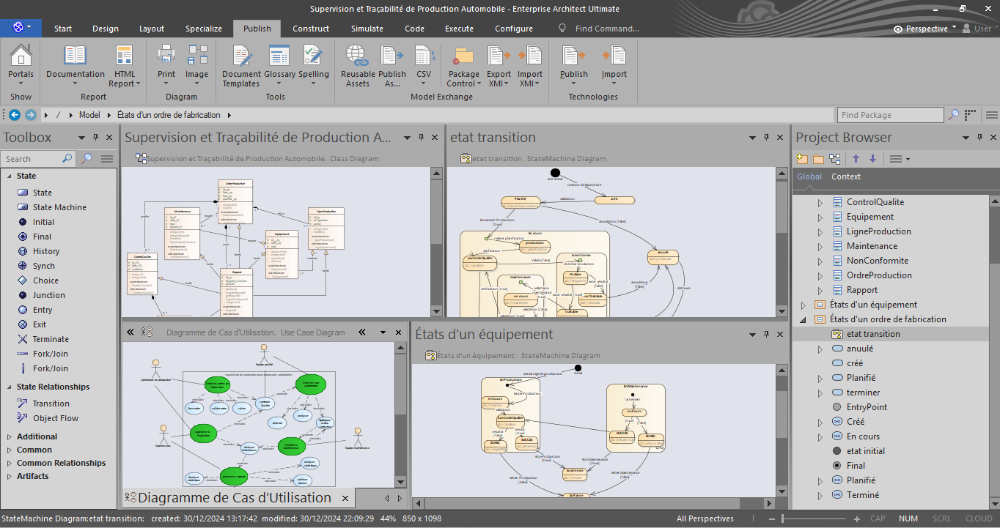

# Mini-Projet-N-2-Supervision-et-Tra-abilit-de-Production-Automobile
 
<h1>I. CONTEXTE DU PROJET</h1>
<h4>Description du Système Le système de supervision de production pour composants automobiles vise à :</h4>
1- Assurer la traçabilité complète de la production.  
2- Superviser en temps réel les performances.  
3- Gérer la qualité et la maintenance.  
4- Fournir des analyses et rapports détaillés.  
 
<h1>Commentaire :</h1>
<h3>Nous avons décidé de réaliser ce projet dans un délai court tout en garantissant une qualité professionnelle. Le défi consiste à le mener à bien sans utiliser l'intelligence artificielle. Nous sommes convaincus que nous réussirons ce challenge. Nous avons créé tous les diagrammes demandés en y ajoutant les éléments nécessaires pour les rendre parfaits. Nous avons également pris le temps de détailler et de comprendre de nouveaux concepts, tels que le modèle MVC et d'autres notions importantes.</h3>
<h3>AGL utilisé :</h3>
1- Enterprise Architect ultimate EA  

